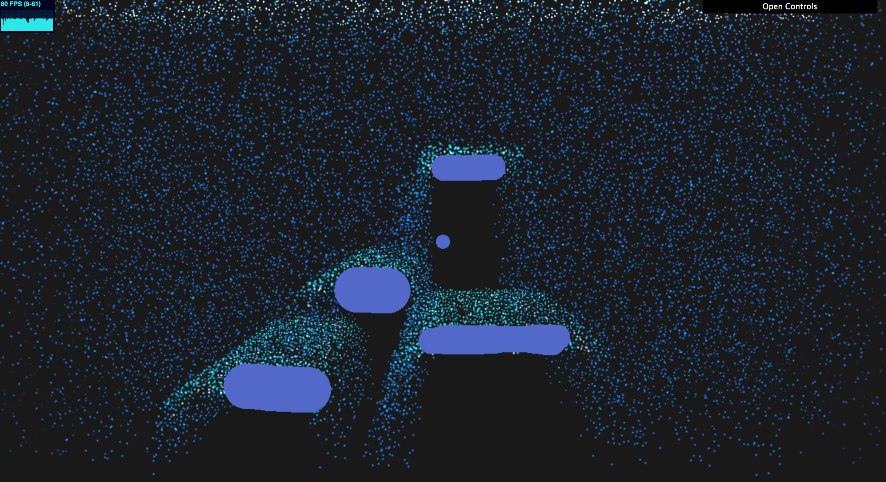
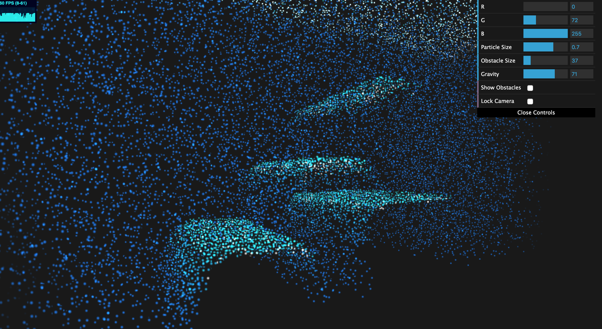
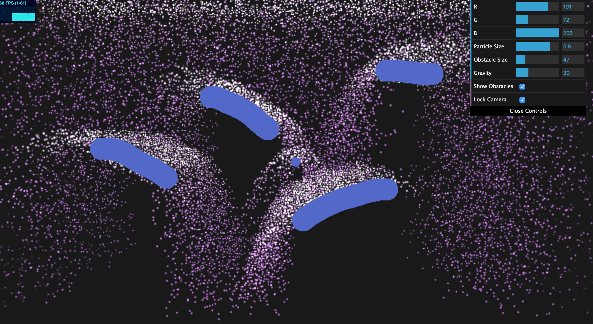
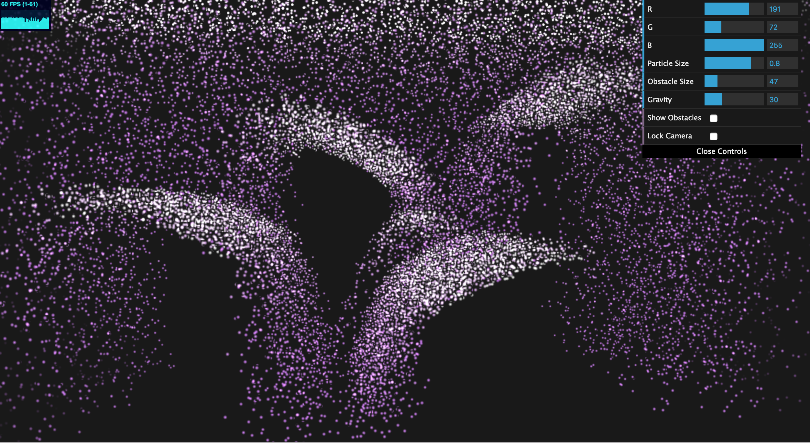

# Waterfall - Particle Simulation

### An interactive waterfall-inspired particle simulation

### Chloe Le (chloele)
- https://chloele.com/

### Live Demo: 
-  http://www.chloele.com/particle-waterfall/

 

 

## References

Particle animation is based on the paper [Particle Animation and Rendering Using Data Parallel Computation](https://www.karlsims.com/papers/ParticlesSiggraph90.pdf). 

## Inspiration
This project is based on the paper [Particle Animation and Rendering Using Data Parallel Computation](https://www.karlsims.com/papers/ParticlesSiggraph90.pdf). 
It is especially inspired by the waterfall simulation mentioned in the paper's result seciont

## Features Implemented
- Transform Feedback 
- Instanced Rendering
- Particle animation with simulated physics 
- Obstacles using textures
- User interaction

## Implementation
 
### Transform Feedback
I set up the ParticleCollection class with WebGLTransformFeedback. 
In creating the particle collection, I bind arrays for time, colors, velocity, and position. 
These arrays are then bound to be the vertex shaders attributes.
After setting up buffers for them, I am also calling gl.bindTransformFeedback at the end of setting the VBOs. 
In the main function a shader for transform feedback is created with the vertex shader and frag shader(although frag is ignored in the case of TF).
Every frame, the transform feedback shader is calling on a tranform function that takes in the Particle Collection class. 
In the function, we are binding to gl's transform feedback and setting attribute per vertex's divisor to be 0.
All particle update is done in the transform feedback vertex shader. Then rendered out using another vert and frag shader that just simply do basic instanced rendering.

### Particle Animation
Particle animation is all done in the transform feedback shader for efficient computation.
- Representing a particle with attribute elements 
    - Position 
    - Velocity
    - Radius
    - Color
    - Time
- Initialization
    - Position: randomly set inside a rectangular solid that has a bounded space size in x, y, and z direction.
    - Velocity: randomly within a rectangular solid and normalized 
    - Acceleration: stays constant throughout, and is a uniform value taken from the user 
- Color: Mixing passed in uniform color with the particle's position and velocity. 
if the particle is at the top of the particle space or in contact with an obstacle surface, then the color is set to white to simulate
a splash effect
- Gravity
    - constant acceleration downwards applied on the velocity by simply adding to the previous velocity a deltaT * acceleration term. 
- Bounce
    - Check normalized position (by dividing by the space size accordingly) against the uniform sampler2D.  
    - If obstacle is detected: reflect the velocity of particles that have passed beyond the boundary of the surface by the obstacle normal N
    - if the velocity is low, multiply it by the obstacle normal to jitter outwards 
    - velocity is then multiplied with a MAX_SPEED / length of the velocity, if the value is greater than 1, make it 1. This is to ensure that the bounce 
    does not get too far away from the obstacle
- Update
    - first update velocity, check with if out of bound or obstacle collision 
    - update position, check with if out of bound, if so, reset and reuse the particle. 
    Then check with obstacle, if collision is detected, add the obstacle normal to the position to move the particle out of the obstacle location.

### Instanced Rendering
After transform feedback shader is done, the program then calls the shader for drawing particles on a render particle function. In this function, particle collection is passed in, 
and color, position, and source VAO are set. gl.draw is then called to render out the particle. In the vert shader, model position and billboard position are computed. Then gl_position is 
billboard multiplied with the uniform view matrix to have it in 3d space. 

### Obstacles/textures
The way obstacles are done in this program is by using texture methods. Each stroke of obstacle is actually a stroke of many circles rendered onto a texture one at a time. 
I created shaders for creating and mapping the circle at the desired location with the desired radius, then it is saved to a gl texture channel that is then activated for rendering (with another shader to 
actually draw the obstacle, only when the drawing toggle is turned on).
Detect obstacle collision: 
- Particles' positions are checked against the obstacles' normals, which is from sampler2D texture's rg channels. 

### User interaction
User interaction is achieved by taking in values from the gui in the upper right corner. The change of these controls are then 
bound with functions that would call set uniform values in the corresponding shaders to update the output.
- particle color
- particle size
- gravity
- obstacle size: the radius of obstacle the user wishes to draw with
- lock camera (snaps and locks to original frame)
- show and draw obstacle (with this option checked, the user can click and hold and drag the mouse to draw obstacles
onto the scene, works the best when the lock camera option is selected as well)

The program also takes into account mouse actions such as onMouseDown, onMouseMove, and onMouseUp. These events would then call the 
addObstacle function that is going to add one more circle to the texture. If an add event is detected, a boolean is toggled, and the tick 
function with then draw all obstacles that are inside a list in that frame. 

